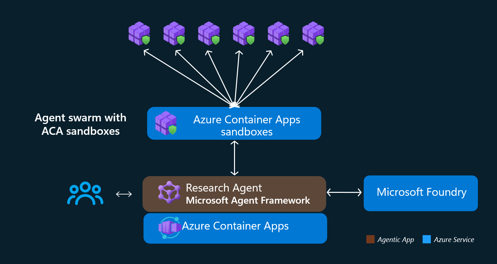

# Your Agent Swarm Needs More Than a Loop

One agent is easy to picture. Give it a prompt. Let it call a tool. Read the answer.

Then you add five more.

Now the real questions show up. Do they actually run concurrently? Where does their code execute? What can each agent reach on the network? How do you preload your frameworks and proprietary code without installing everything six times? And when one branch fails, can you trace the request from the original topic to the exact sandbox that went sideways?

We built a research swarm to work through those questions with real infrastructure. Not a diagram that stops at the model call. A deployable workflow built with Microsoft Agent Framework, an orchestrator running as an Azure Container Apps application, and isolated researchers running inside Azure Container Apps Sandboxes.

That distinction matters. Azure Container Apps hosts the long-running web application and workflow orchestrator. ACA Sandboxes provide the separate, ephemeral execution environments where individual researchers do their work.

## The Architecture

The application accepts a research topic, asks a decomposer to produce sub-questions, fans those questions out to as many as six researcher agents, and combines their findings through a synthesizer. Every researcher gets its own ACA Sandbox, its own question, and a tightly restricted network boundary.

**Who this is for:** teams building agents that need parallel execution, custom code, strong isolation, controlled egress, keyless Azure access where supported, and one observable path across the full workflow.



The flow of information is simple:

```text
You provide a topic
  |
  v
Decomposer decomposes it to multiple sub-topics.
  |
  +--> researcher 1 --> ACA Sandbox 1 --+
  +--> researcher 2 --> ACA Sandbox 2 --+
  +--> researcher 3 --> ACA Sandbox 3 --+  --> Synthesizer compiles the report based on information from all researches --> Final report
  +--> researcher 4 --> ACA Sandbox 4 --+
  +--> researcher 5 --> ACA Sandbox 5 --+
  +--> researcher 6 --> ACA Sandbox 6 --+
```

The diagram is simple. Making each branch truly concurrent, isolated, and observable takes a few deliberate design choices.

## 1. Real concurrency needs separate workflow edges

Microsoft Agent Framework gives us the agents and the workflow graph. The decomposer returns a list of questions. The workflow caps that list at six, creates a fixed pool of researcher executors, and targets one researcher for each question.

Then the synthesizer receives the researcher responses through fan-in and produces the final Markdown report.

The surprising part was the fan-out.

It is tempting to express all researchers as one fan-out edge group. That looks correct on a whiteboard. In this implementation, however, one fan-out runner would deliver targeted messages sequentially. The graph would look parallel while the researcher model calls were serialized inside that runner.

So the workflow creates an individual edge for every researcher:

```python
builder = WorkflowBuilder(start_executor=decomposer)
for researcher in researchers:
    builder = builder.add_edge(decomposer, researcher)

workflow = builder.add_fan_in_edges(
    list(researchers),
    synthesizer,
).build()
```

That is intentional. Separate edge runners let Microsoft Agent Framework schedule the researcher branches concurrently instead of putting six calls behind one delivery loop.

Each researcher agent stays deliberately thin. It has one tool, `run_in_sandbox`. The tool creates the sandbox, waits for the in-sandbox research process, retrieves the structured result, and deletes the sandbox. The researcher returns that result verbatim rather than asking another model call to rewrite it.

The workflow coordinates reasoning. The sandbox tool owns isolated execution.

Container Apps orchestrates. Sandboxes execute.

The names are close enough to create confusion, so let us make the boundary explicit.

| Component | Azure service | Responsibility |
|---|---|---|
| Orchestrator | Azure Container Apps | Hosts FastAPI, the UI, WebSocket progress, Microsoft Agent Framework workflow, and sandbox lifecycle code |
| Researcher runtime | ACA Sandboxes | Runs one research question inside a separate isolated environment |
| Sandbox group | ACA Sandboxes resource | Provides the control boundary used to create disk images and sandboxes |

The orchestrator is a normal Azure Container App. It remains available, accepts topics, builds the workflow, and manages the fan-out.

The researcher is not another Container App replica. It runs from a disk image inside a newly created ACA Sandbox. One question goes in. One research result comes out. The sandbox is removed after the branch completes.

That separation gives every researcher its own execution boundary while keeping orchestration in a familiar web application.

## 2. Give every researcher a locked-down workspace

Compute isolation is only half the boundary. An autonomous researcher should not inherit unrestricted internet access just because it needs web search.

Every sandbox starts with default-deny egress. The orchestrator adds allow rules only for the endpoints required by the workload:

- Azure OpenAI for the direct model path
- Microsoft Foundry for the hosted research path
- Application Insights ingestion endpoints for telemetry

The policy is built with `default_action="Deny"`:

```python
_allow(self.openai_endpoint)
_allow(self.foundry_project_endpoint)

for endpoint in self._appinsights_egress_endpoints():
    _allow(endpoint)

return EgressPolicy(
    default_action="Deny",
    host_rules=host_rules,
)
```

There is no search-engine allow rule.

That is not an omission. The researcher uses Foundry hosted web search, and the search runs server-side in Foundry. From inside the sandbox, the agent calls the Foundry project endpoint. Foundry performs the search. The sandbox does not need direct access to Bing or another public search engine.

This is a useful pattern beyond research. Put broad external capability behind a service endpoint you trust, then give the sandbox access to that endpoint instead of opening the internet.

Authentication follows the same boundary.

The Bicep deployment creates user-assigned managed identities for the orchestrator and sandbox group, then grants scoped roles for Azure OpenAI, Foundry, the sandbox group data plane, and ACR pulls. The orchestrator uses its Azure identity to obtain short-lived bearer tokens for the Azure OpenAI and Foundry audiences.

Those scoped tokens are forwarded into the egress-restricted sandbox as environment variables. The in-sandbox researcher wraps the Foundry token in a credential implementation, so it does not need to call Microsoft Entra ID or an instance metadata endpoint from inside the locked network.

No model API key needs to be baked into the researcher image.

## 3. Bake the researcher once

You can start from a public or base image and bootstrap the environment after the sandbox starts. Install packages. Pull frameworks. Download tools. Clone code. Then run the researcher.

That path is valid for small experiments.

It is rarely the shape customers want for a real agent workload. Their researchers need specific Python packages, agent frameworks, diagnostic tooling, security controls, and proprietary code. Reassembling that environment for every question adds moving parts to the hottest path in the system.

This sample builds the researcher as an OCI container image in Azure Container Registry, then creates a custom sandbox disk image from it. The researcher code and dependencies are already present when the sandbox starts.

The next challenge is freshness. A cached disk image is useful only if it matches the code you intended to run.

The orchestrator handles that with an ACR digest cache:

1. Resolve the current manifest digest for the configured ACR image.
2. List disk images associated with that image reference.
3. Reuse a matching disk image only when its state is `Ready` and its stored OCI digest matches ACR.
4. Build a new disk image when the digest changed or no usable match exists.
5. Delete stale images after selecting or creating the current one.

The image labels store both the source image reference and its OCI digest. A tag such as `research-agent:latest` can move, but the digest tells the orchestrator whether the underlying content changed.

There is one more practical step. The FastAPI lifespan hook starts disk-image preparation when the orchestrator starts. That prewarm resolves the digest and either reuses or builds the disk image before a user submits a topic. If prewarm fails, the application still starts and the normal request path can report the same problem.

Push new researcher code to ACR. The digest changes. The next preparation cycle rebuilds once. Later requests reuse the matching `Ready` image.

## 4. Connect the swarm with one distributed trace

Parallel systems fail in parallel too. A log line that says "research failed" is not enough when six sandboxes, several model calls, and a synthesis step are active.

The sample configures OpenTelemetry and exports supported telemetry to Application Insights. Microsoft Agent Framework instrumentation adds spans for agent runs and tool calls. FastAPI is instrumented in the orchestrator. The sandbox manager adds a `sandbox.create` span, and the Azure Monitor OpenTelemetry setup instruments supported outbound HTTP libraries used by the application.

The researcher process inside each sandbox configures the same telemetry destination.

The connection happens through W3C trace context. Before sandbox creation, the orchestrator injects `traceparent` and, when present, `tracestate` into the sandbox environment. The researcher extracts that context and starts its `research-agent.run` span under the same distributed trace.

The result is one trace path designed to connect:

- Topic decomposition
- Researcher agent and `run_in_sandbox` tool activity
- Sandbox creation and instrumented lifecycle or network operations
- In-sandbox Microsoft Agent Framework research and Foundry calls
- Fan-in and synthesis

Application Insights is provisioned in Bicep as a workspace-based resource backed by Log Analytics. The orchestrator and researchers receive the same connection string, and the sandbox egress policy allows the required ingestion endpoints.

That gives us a shared place to inspect the parts the code actually instruments, without claiming signals the sample does not emit.

## 5. Deploy the whole system

The infrastructure is Bicep. The deployment provisions the Container Apps environment, orchestrator Container App, sandbox group, Azure Container Registry, Foundry resources, managed identities, role assignments, Log Analytics workspace, and workspace-based Application Insights.

The entry point is deliberately short:

```bash
azd up
```

`azd` provisions the Bicep template, remotely builds and pushes the orchestrator image, builds and pushes the research-agent image through the post-provision hook, and deploys the orchestrator to Azure Container Apps.

After that, the orchestrator prepares the digest-cached researcher disk image and starts accepting topics.

The lesson for me was simple. A swarm is not six copies of the same prompt. It is a workflow, an execution boundary, an image lifecycle, an identity path, a network policy, and a trace that survives the fan-out.

Build those pieces together and the concurrency becomes the easy part.

## Next Steps

1. **Try it:** Deploy the sample with `azd up`.
2. **Learn more:** Review the [Azure Container Apps Sandboxes documentation](https://sandboxes.azure.com) and map the egress policy to your own agent dependencies.
3. **Go deeper:** Explore the [Microsoft Agent Framework repository](https://github.com/microsoft/agent-framework) and compare its workflow graph to the individual-edge fan-out used here.
