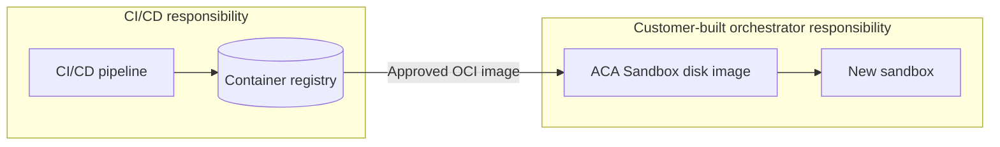

# Chapter 3: Managing Disk Images

Your CI/CD pipeline already knows how to build software. It scans components, enforces governance policy, produces an OCI-compatible image, and publishes an approved artifact to a container registry such as Azure Container Registry (ACR).

Keep that process. ACA Sandboxes add a runtime step after it.

ACA Sandboxes provide isolated microVM-style compute with sub-second startup and snapshot support. To run an OCI image, the platform first converts it into a custom sandbox disk image. That preparation can take tens of seconds depending on the image, so it should finish before a user request needs a new sandbox.

**Who This Is For:** platform teams operating governed agent workloads from private container registries.

## Workflow and Ownership

The clean boundary is the container registry. CI/CD owns everything through publication of the approved OCI image. The customer-built orchestrator owns disk preparation and sandbox lifecycle after that point.



Do not make the pipeline create individual sandboxes. Do not make a user request wait for image conversion. The registry artifact is the contract between the two systems.

## Best Practices

### 1. Design for Private Networking First

Keep the image path private from end to end. Place the orchestrator and registry access path in the organization's private network design, disable public registry access where the deployment supports it, and use private DNS and private endpoints to resolve the registry without crossing the public internet.

Use managed identity for authentication. Give the sandbox group identity only the `AcrPull` permission it needs. Give the orchestrator identity permission to manage disk images and sandboxes in the target sandbox group. Avoid registry admin credentials and long-lived secrets.

The target ACA Sandboxes preview release supports the required private VNet, private endpoint, DNS, and managed identity combination. Validate these capabilities in the deployment region. This sample demonstrates managed identities and RBAC, but it does not configure private endpoints or VNet integration.

### 2. Prepare Images Outside the Request Path

Start conversion when the orchestrator initializes or when it detects a newly approved registry artifact. Run it as background work so the application can continue starting, but do not route sandbox requests to the new image until its state is `Ready`.

Use one of two triggers:

- **Startup reconciliation:** compare the configured image with existing disk images whenever the orchestrator starts.
- **Change notification:** react to a registry event or a CI/CD callback as soon as a new image is published.

Both paths should be idempotent. Concurrent orchestrator replicas must not create duplicate disk images for the same artifact. Use a distributed lock, deployment record, or another coordination mechanism when the orchestrator scales beyond one replica.

### 3. Version by Digest, Not Tag

A tag such as `research-agent:latest` can move. The OCI manifest digest identifies the exact governed content.

Label each disk image with its source image reference and digest:

```python
labels = {
    "image-ref": container_image,
    "oci-digest": current_digest,
}
```

Reuse a disk image only when it is `Ready` and its stored digest matches ACR. If the digest changes, create a new disk image, validate it, switch new sandbox creation to it, and then retire stale versions according to the organization's rollback and retention policy.

This repository demonstrates that pattern in the [sandbox manager](../orchestrator/sandbox_manager.py). It resolves `Docker-Content-Digest`, labels disk images, reuses matching images, and removes stale images in the background. The [application lifespan hook](../orchestrator/orchestrator.py) starts reconciliation during orchestrator initialization.

## Operational Checklist

- Keep the last known-good disk image available for rollback.
- Record the OCI digest, disk image ID, creation state, and creation time.
- Allow new sandboxes only from disk images in the `Ready` state.
- Surface conversion failures without taking the orchestrator offline.
- Monitor conversion duration, failure rate, stale-image cleanup, and registry authentication errors.
- Test image compatibility before promoting a digest to production traffic.

# Chapter 4: Managing Snapshots

A disk image gives every sandbox the same governed filesystem. A snapshot goes further by preserving the state of a configured sandbox so later sandboxes can resume from that point.

Use snapshots when startup includes meaningful repeatable work. Start a preparation sandbox from the approved disk image, initialize expensive components, verify health, and create a named snapshot. New workers can then start from that snapshot:

```bash
aca sandbox snapshot --id "$SANDBOX_ID" --name research-agent-ready
aca sandbox create --snapshot research-agent-ready
```

Treat snapshots as derived artifacts. Attach the source OCI digest and disk image ID to snapshot metadata or an external catalog. A new OCI digest invalidates snapshots derived from the previous disk image.

Before promotion, verify that resumed processes are healthy and that no short-lived credentials, request data, trace context, or machine-specific state were captured. Keep snapshot creation in a controlled preparation workflow, not in the request path. Retain a last known-good snapshot for rollback and delete stale snapshots according to policy.

The sample does not create snapshots today. Its digest-based disk-image lifecycle provides the foundation for adding this second cache layer.

## Next Steps

1. **Try it:** Use the sample's digest labels to reconcile a registry image with one `Ready` disk image.
2. **Learn more:** Review the [identity and registry configuration](../infra/main.bicep), then map it to the organization's private networking standard.
3. **Go deeper:** Add a snapshot preparation workflow keyed to the source OCI digest and validate resumed agent health before promotion.